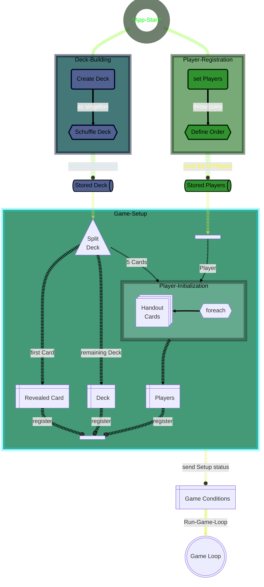

##### 
 PoseUebung-016 

# 
 Card Game Simulation 

```mermaid
 
flowchart TB

  %% NODES:
    fxStrtCndtns[ Game Conditions ]@{ shape: win-pane }
    dfPlyrOrdr[   Define Order    ]@{ shape: hex      }
    bgnGame[      Game Loop       ]@{ shape: dbl-circ }
    players[      Players         ]@{ shape: win-pane }
    fxPlyr[       Stored Players  ]@{ shape: h-cyl    }
    dfPlyr[       set Players     ]@{ shape: rounded  }
    rvCrd[        Revealed Card   ]@{ shape: win-pane }
    shDck[        Schuffle Deck   ]@{ shape: hex      }
    crDck[        Create Deck     ]@{ shape: rounded  }
    fxDck[        Stored Deck     ]@{ shape: h-cyl    }
    strt[         *App-Start*     ]@{ shape: circle   }
    init[         i               ]@{ shape: fork     }
    ip[           i               ]@{ shape: fork     }
    e[            foreach         ]@{ shape: hex }
    d[            Deck            ]@{ shape: win-pane }
         
         id@{ shape: tri,     label: "Split\n Deck"  }
    hndPlyr@{ shape: st-rect, label: "Handout\nCards" }
    
  %% CLASS STYLES:
    style strt color:#0f0f, fill:#f1f4f230, stroke:#001f0090, stroke-width:33px;
  
    style dfPlyr color:#000, fill:#319230, stroke:#001f00, stroke-width:3px;
    style crDck  color:#000, fill:#516192, stroke:#00001f, stroke-width:3px;
    
    style dfPlyrOrdr color:#000, fill:#319230, stroke:#001f00, stroke-width:3px;
    style shDck      color:#000, fill:#516192, stroke:#00001f, stroke-width:3px;
    
    style fxPlyr color:#000, fill:#319230, stroke:#000, stroke-width:2px;
    style fxDck  color:#000, fill:#516192, stroke:#000, stroke-width:2px;
    
    style Player-Registration color:#000, fill:#7a7, stroke:#001f0070, stroke-width:9px;
    style Deck-Building       color:#000, fill:#477, stroke:#00001f70, stroke-width:9px;
    style Game-Setup          color:#000, fill:#497, stroke:#04edff50, stroke-width:10px;
  
    style Player-Initialization color:#000, fill:#f0f0f031, stroke:#00000050, stroke-width:10px;

  %%_BUILDING: ________________________________________________________________
    strt -.- Deck-Building
    strt -.- Player-Registration 
      linkStyle 0,1 color:#000, stroke:#af6, stroke-width:8px;

    %%___PLAYERS: _____________________
    subgraph Player-Registration
      direction TB
      dfPlyr --> | throw coins | dfPlyrOrdr 
        linkStyle 2 color:#fff, stroke:#000, stroke-width:4px;
    end
    Player-Registration -.-o | send list of Players | fxPlyr
      linkStyle 3 color:#ffff00, stroke:#a0f06090, stroke-width:13px;

    %%___DECK: ________________________
    subgraph Deck-Building
      direction TB
      crDck --> | as singelton | shDck
        linkStyle 4 color:#fff, stroke:#000, stroke-width:4px;
    end
    Deck-Building -.-o | send shuffled Deck   | fxDck
      linkStyle 5 color:#cef, stroke:#a0f06090, stroke-width:13px;
   
      fxPlyr -.-> ip
      fxDck  -.-> id
        linkStyle 6,7 stroke:#e0f0407f, stroke-width:8px;
      
  %%_GAME-SETUP: ______________________________________________________________
    subgraph Game-Setup
      direction TB 

    %% PLAYER INIT:
      ip -.-> | Player  | Player-Initialization
      id -.-> | 5 Cards | Player-Initialization 
        linkStyle 8,9 stroke:#000, stroke-width:3px;

        subgraph Player-Initialization
          direction RL
          e --> hndPlyr
            linkStyle 10 stroke:#000, stroke-width:3px;
        end

      Player-Initialization -..-> players
      id                   -.->          | first Card     | rvCrd
      id                   -.->          | remaining Deck | d
      players              -.-o          | register | init   
      rvCrd                -.-o          | register | init
      d                    -.-o          | register | init
 
       linkStyle 11,12,13,14,15,16 stroke:#000, stroke-width:8px;
       
  
  

    end

    Game-Setup -.....-o  | send Setup status | fxStrtCndtns 
      linkStyle 17 stroke:#e0f0407f, stroke-width:8px;

  %% GAME-LOOP: 
    fxStrtCndtns ==> | Run-Game-Loop     | bgnGame
      linkStyle 18 stroke:#e0f0407f, stroke-width:8px;

```

