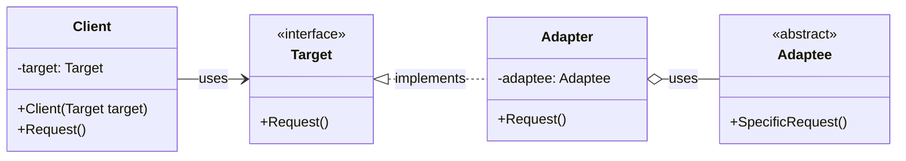
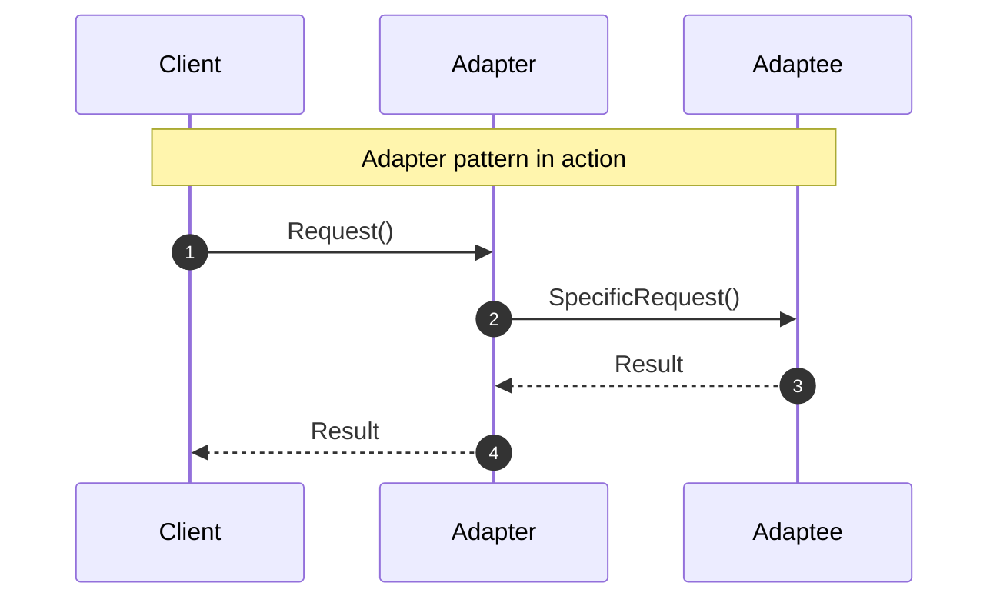

<!-- by IxI-Enki -->

# Adapter
### <p align="center"> Class Diagram </p>

---
### <p align="center"> Sequence Diagram </p>

---
### <p align="center"> Implementation </p>
<div align="left">

```c#
// Defines the domain-specific interface
public interface ITarget
{
    void Request();
}
```
```c#
// Existing class with incompatible interface
public class Adaptee
{
    public void SpecificRequest()
    {
        Console.WriteLine("Adaptee's SpecificRequest called.");
    }
}
```
```c#
// Adapter class that adapts Adaptee to ITarget
public class Adapter : ITarget
{
    private readonly Adaptee _adaptee;

    public Adapter(Adaptee adaptee)
    {
        this._adaptee = adaptee;
    }

    // Implement ITarget's interface
    public void Request()
    {
        // Delegate to Adaptee's method
        _adaptee.SpecificRequest();
    }
}
```
```c#
// Client class uses ITarget interface
public class Client
{
    private ITarget _target;

    public Client(ITarget target)
    {
        this._target = target;
    }

    public void Request()
    {
        _target.Request(); // Client doesn't know if it's interacting with Adapter or another implementation of ITarget
    }
}
```
```c#
public class Program
{
    public static void Main(string[] args)
    {
        Adaptee adaptee = new Adaptee();
        ITarget target = new Adapter(adaptee);
        Client client = new Client(target);
        client.Request(); // Output: Adaptee's SpecificRequest called.
    }
}
```
  </div>

<!-- by IxI-Enki -->