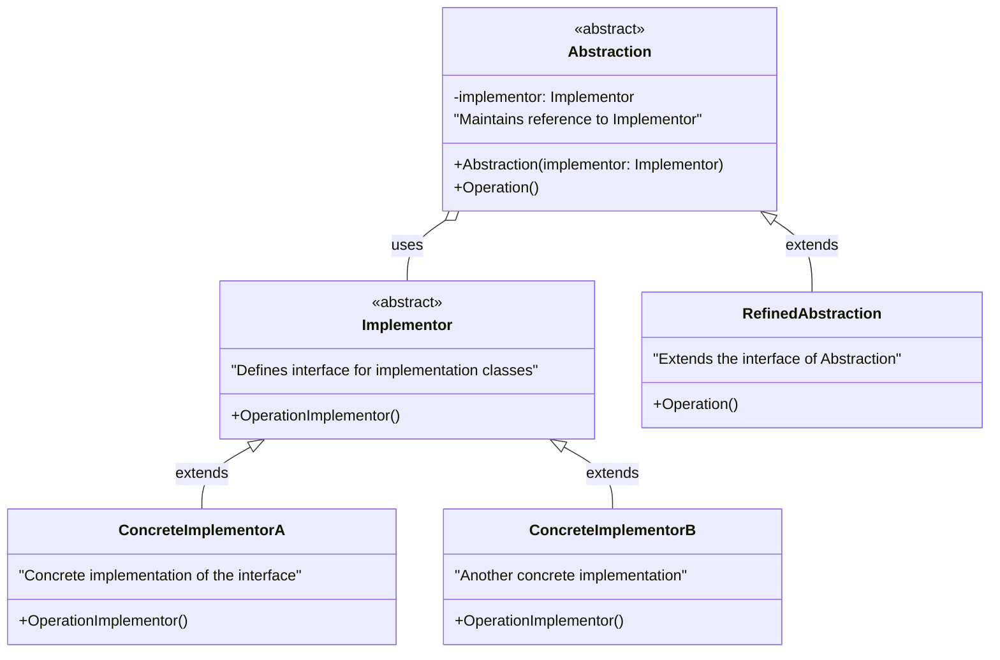
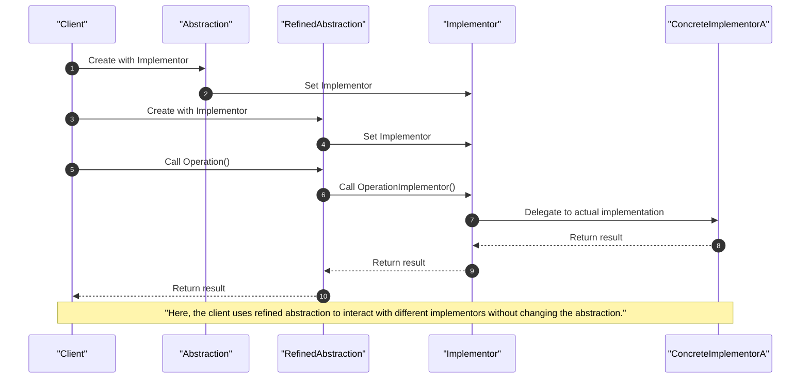

<!-- by IxI-Enki -->

# Bridge
### <p align="center"> Class Diagram </p>

---
### <p align="center"> Sequence Diagram </p>
autonumber

---
### <p align="center"> Implementation </p>
<div align="left">

```c#
// Implementor interface
public abstract class Implementor
{
    public abstract void OperationImplementor();
}
```
```c#
// Concrete Implementors
public class ConcreteImplementorA : Implementor
{
    public override void OperationImplementor()
    {
        Console.WriteLine("ConcreteImplementorA performs operation.");
    }
}

public class ConcreteImplementorB : Implementor
{
    public override void OperationImplementor()
    {
        Console.WriteLine("ConcreteImplementorB performs operation.");
    }
}
```
```c#
// Abstraction
public abstract class Abstraction
{
    protected Implementor implementor;

    protected Abstraction(Implementor implementor)
    {
        this.implementor = implementor;
    }

    public abstract void Operation();
}
```
```c#
// Refined Abstraction
public class RefinedAbstraction : Abstraction
{
    public RefinedAbstraction(Implementor implementor) : base(implementor) { }

    public override void Operation()
    {
        // Refined behavior can be added here
        implementor.OperationImplementor();
    }
}
```
```c#
// Client code
public class Program
{
    public static void Main(string[] args)
    {
        // Create implementor objects
        Implementor implementorA = new ConcreteImplementorA();
        Implementor implementorB = new ConcreteImplementorB();

        // Create abstraction with different implementors
        Abstraction abstractionA = new RefinedAbstraction(implementorA);
        Abstraction abstractionB = new RefinedAbstraction(implementorB);

        // Call operations on abstractions
        abstractionA.Operation(); // Output: ConcreteImplementorA performs operation.
        abstractionB.Operation(); // Output: ConcreteImplementorB performs operation.
    }
} 
```
</div>

<!-- by IxI-Enki -->classDiagram
    