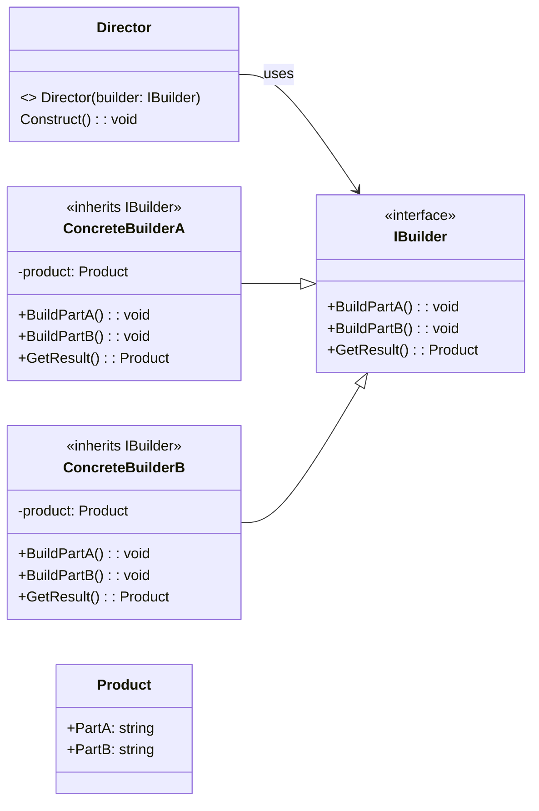
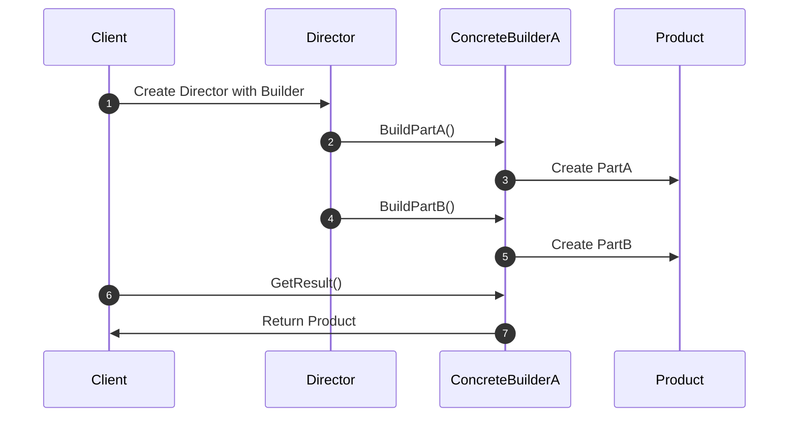

<!-- by IxI-Enki -->

# Builder
### <p align="center"> Class Diagram </p>

---
### <p align="center"> Sequence Diagram </p>

---
### <p align="center"> Implementation </p>
<div align="left">

```c#
// Product class
public class Product
{
    public string PartA { get; set; }
    public string PartB { get; set; }

    public override string ToString()
    {
        return $"Product: [PartA: {PartA}, PartB: {PartB}]";
    }
}
```
```c#
// Builder interface
public interface IBuilder
{
    void BuildPartA();
    void BuildPartB();
    Product GetResult();
}
```
```c#
// Concrete Builder
public class ConcreteBuilderA : IBuilder
{
    private Product _product = new Product();

    public void BuildPartA()
    {
        _product.PartA = "PartA from ConcreteBuilderA";
    }

    public void BuildPartB()
    {
        _product.PartB = "PartB from ConcreteBuilderA";
    }

    public Product GetResult()
    {
        return _product;
    }
}
```
```c#
// Director class
public class Director
{
    private IBuilder _builder;

    public Director(IBuilder builder)
    {
        _builder = builder;
    }

    public void Construct()
    {
        _builder.BuildPartA();
        _builder.BuildPartB();
    }
}
```
```c#
// Client code
public class Program
{
    public static void Main(string[] args)
    {
        var builder = new ConcreteBuilderA();
        var director = new Director(builder);
        director.Construct();

        Product product = builder.GetResult();
        Console.WriteLine(product.ToString());
    }
}
```
</div>

<!-- by IxI-Enki -->