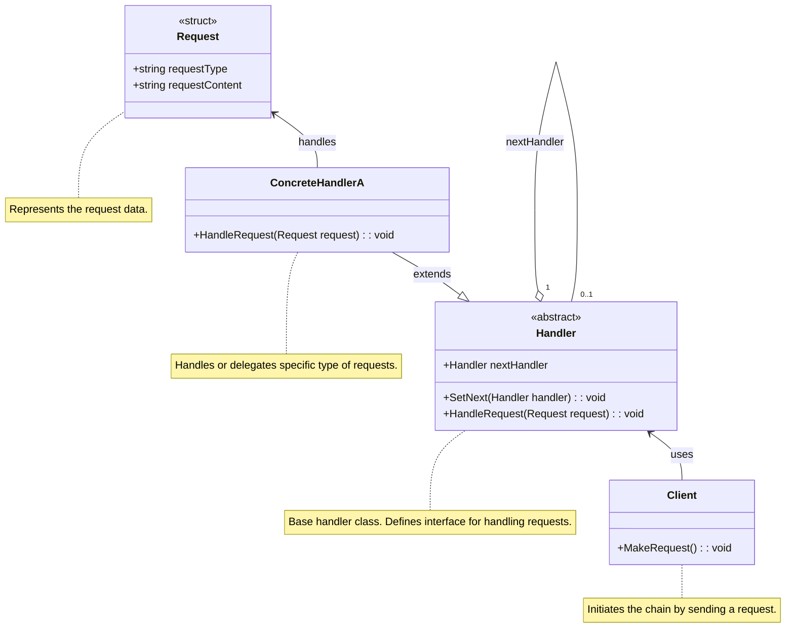
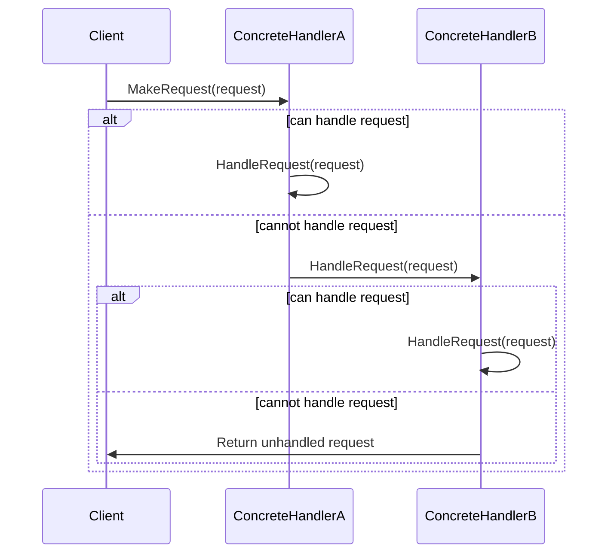

<!-- by IxI-Enki -->

# Chain
### <p align="center"> Class Diagram </p>

---
### <p align="center"> Sequence Diagram </p>
autonumber

---
### <p align="center"> Implementation </p>
<div align="left">

```c#
public abstract class Handler
{
    protected Handler successor;

    public void SetNext(Handler next)
    {
        this.successor = next;
    }

    public void HandleRequest(Request request)
    {
        if (CanHandle(request))
        {
            Handle(request);
        }
        else if (successor != null)
        {
            successor.HandleRequest(request); // Delegate to next handler
        }
    }

    protected abstract bool CanHandle(Request request);
    protected abstract void Handle(Request request);
}
```
```c#
public class ConcreteHandlerA : Handler
{
    protected override bool CanHandle(Request request)
    {
        return request.RequestType == "TypeA"; // Handles requests of TypeA
    }

    protected override void Handle(Request request)
    {
        Console.WriteLine("ConcreteHandlerA handled the request.");
    }
}
```
```c#
public struct Request
{
    public string RequestType { get; set; }
    public string RequestContent { get; set; }

    public Request(string type, string content)
    {
        RequestType = type;
        RequestContent = content;
    }
}
```
```c#
public class Client
{
    public void MakeRequest(Handler handler, string requestType, string content)
    {
        Request request = new Request(requestType, content);
        handler.HandleRequest(request);
    }
}

// Usage example in Main or another method:
public static void Main()
{
    Handler h1 = new ConcreteHandlerA();
    Handler h2 = new ConcreteHandlerB();
    h1.SetNext(h2);

    Client client = new Client();
    client.MakeRequest(h1, "TypeA", "Request for TypeA"); // Should be handled by ConcreteHandlerA
    client.MakeRequest(h1, "TypeB", "Request for TypeB"); // Should be handled by ConcreteHandlerB
}
```
</div>

<!-- by IxI-Enki -->