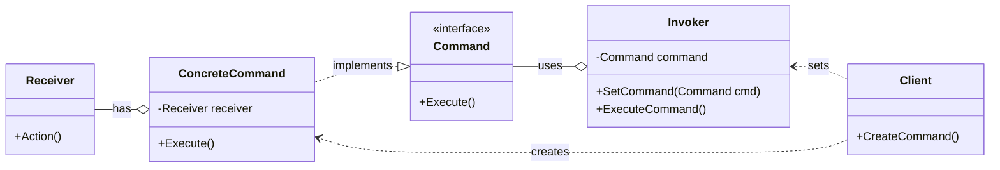
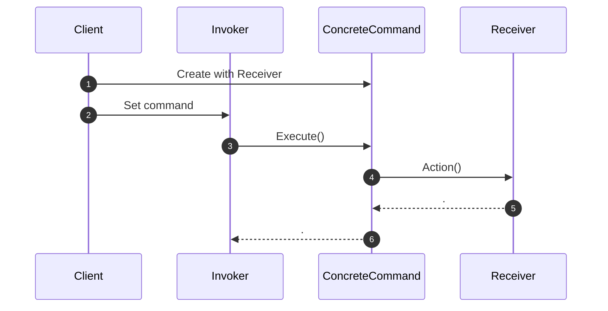

<!-- by IxI-Enki -->

# Command
### <p align="center"> Class Diagram </p>

---
### <p align="center"> Sequence Diagram </p>

---
### <p align="center"> Implementation </p>
<div align="left">

```c#
// Command interface
public interface ICommand
{
    void Execute();
}
```
```c#
// Concrete Command
public class ConcreteCommand : ICommand
{
    private Receiver receiver;

    public ConcreteCommand(Receiver receiver)
    {
        this.receiver = receiver;
    }

    public void Execute()
    {
        // Call receiver's Action method
        this.receiver.Action();
    }
}
```
```c#
// Receiver
public class Receiver
{
    public void Action()
    {
        // Perform some action
        Console.WriteLine("Receiver does something");
    }
}
```
```c#
// Invoker
public class Invoker
{
    private ICommand command;

    public void SetCommand(ICommand command)
    {
        this.command = command;
    }

    public void ExecuteCommand()
    {
        // Execute the command
        this.command?.Execute();
    }
}
```
```c#
// Client code
public class Program
{
    public static void Main()
    {
        Receiver receiver = new Receiver();
        ConcreteCommand concreteCommand = new ConcreteCommand(receiver);
        Invoker invoker = new Invoker();

        invoker.SetCommand(concreteCommand);
        invoker.ExecuteCommand(); // Outputs: Receiver does something
    }
}
```

</div>

<!-- by IxI-Enki -->