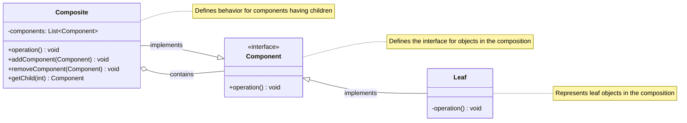

<!-- by IxI-Enki -->

# Composite
### <p align="center"> Class Diagram </p>

---
### <p align="center"> Sequence Diagram </p>

---
### <p align="center"> Implementation </p>
<div align="left">

```c#
// Component interface
public interface IComponent
{
    // Method signature for the operation to be performed
    void Operation();
}

// Leaf class
public class Leaf : IComponent
{
    public void Operation()
    {
        Console.WriteLine("Leaf operation");
    }
}
```
```c#
// Composite class
public class Composite : IComponent
{
    private List<IComponent> _children = new List<IComponent>();

    // Here we implement the interface method
    public void Operation()
    {
        Console.WriteLine("Composite operation starts");
        foreach (IComponent component in _children)
        {
            component.Operation(); // Delegate to child components
        }
        Console.WriteLine("Composite operation ends");
    }

    // Methods to manage children
    public void Add(IComponent component)
    {
        _children.Add(component);
    }

    public void Remove(IComponent component)
    {
        _children.Remove(component);
    }

    public IComponent GetChild(int index)
    {
        return _children[index];
    }
}
```
```c#
// Client code example
public class Program
{
    public static void Main(string[] args)
    {
        Composite root = new Composite();
        root.Add(new Leaf());
        root.Add(new Leaf());

        Composite branch = new Composite();
        branch.Add(new Leaf());

        root.Add(branch);

        root.Operation(); // This will trigger operations on all components in the tree
    }
}
```
</div>

<!-- by IxI-Enki -->