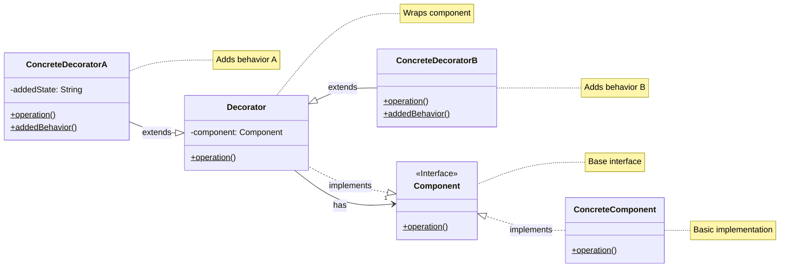
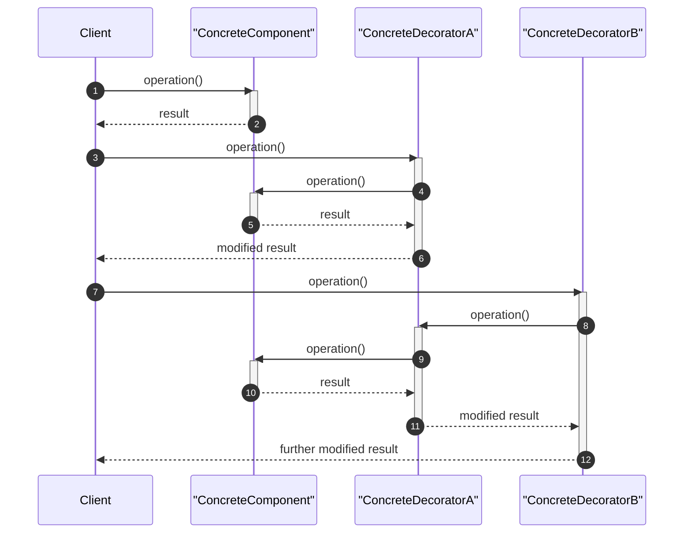

<!-- by IxI-Enki -->

# Decorator
### <p align="center"> Class Diagram </p>

---
### <p align="center"> Sequence Diagram </p>

---
### <p align="center"> Implementation </p>
<div align="left">

```c#
// Interface for components
public interface IComponent
{
    string Operation();
}
```
```c#
// Concrete component
public class ConcreteComponent : IComponent
{
    public string Operation() => "ConcreteComponent.Operation()";
}
```
```c#
// Base Decorator class
public abstract class Decorator : IComponent
{
    protected IComponent component;
    public Decorator(IComponent component) => this.component = component;
    public virtual string Operation() => component?.Operation() ?? string.Empty;
}
```
```c#
// Concrete Decorator A
public class ConcreteDecoratorA : Decorator
{
    private string addedState;
    public ConcreteDecoratorA(IComponent component) : base(component) => addedState = "New State";
    public override string Operation() => $"{base.Operation()} + Added Behavior A";
    public string AddedBehavior() => $"DecoratorA.AddedBehavior() with state: {addedState}";
}
```
```c#
// Concrete Decorator B
public class ConcreteDecoratorB : Decorator
{
    public ConcreteDecoratorB(IComponent component) : base(component) { }
    public override string Operation() => $"{base.Operation()} + Added Behavior B";
    public string AddedBehavior() => "DecoratorB.AddedBehavior()";
}
```
```c#
// Usage example
class Program
{
    static void Main()
    {
        IComponent simple = new ConcreteComponent();
        Console.WriteLine(simple.Operation());

        IComponent decoratorA = new ConcreteDecoratorA(simple);
        Console.WriteLine(decoratorA.Operation());
        Console.WriteLine(((ConcreteDecoratorA)decoratorA).AddedBehavior());

        IComponent decoratorB = new ConcreteDecoratorB(decoratorA);
        Console.WriteLine(decoratorB.Operation());
        Console.WriteLine(((ConcreteDecoratorB)decoratorB).AddedBehavior());
    }
}
```
</div>

<!-- by IxI-Enki -->