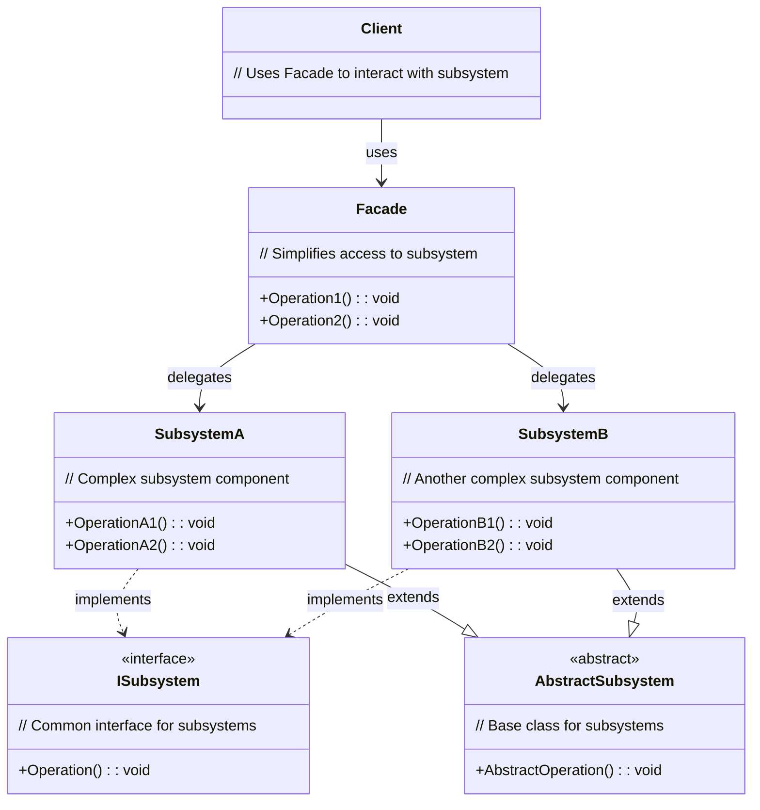
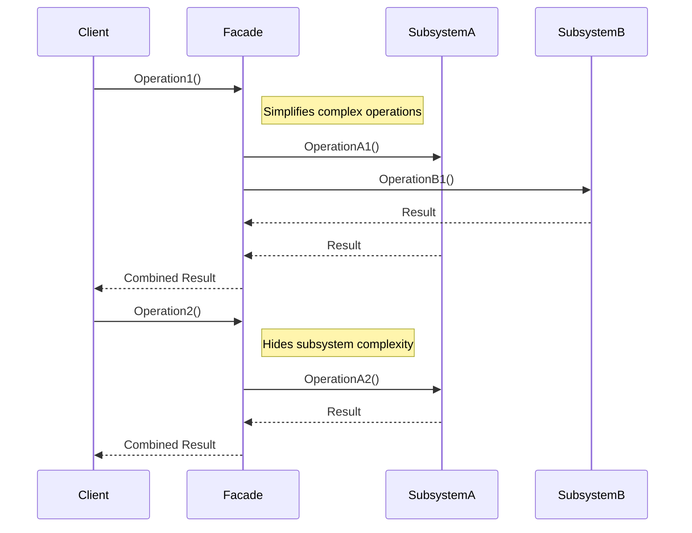

<!-- by IxI-Enki -->

# Facade
### <p align="center"> Class Diagram </p>

---
### <p align="center"> Sequence Diagram </p>

---
### <p align="center"> Implementation </p>
<div align="left">

```c#
// Common interface for all subsystem components
public interface ISubsystem
{
    void Operation(); // Single method to be implemented by all subsystems
}
```
```c#
// Abstract base class for subsystem components
public abstract class AbstractSubsystem : ISubsystem
{
    public abstract void Operation(); // Must be implemented by subclasses
    
    public void AbstractOperation()
    {
        // Common functionality for all subsystems
        Console.WriteLine("Abstract operation performed");
    }
}
```
```c#
// Concrete subsystem classes
public class SubsystemA : AbstractSubsystem
{
    public override void Operation() => Console.WriteLine("SubsystemA Operation");
    public void OperationA1() => Console.WriteLine("SubsystemA OperationA1");
    public void OperationA2() => Console.WriteLine("SubsystemA OperationA2");
}

public class SubsystemB : AbstractSubsystem
{
    public override void Operation() => Console.WriteLine("SubsystemB Operation");
    public void OperationB1() => Console.WriteLine("SubsystemB OperationB1");
    public void OperationB2() => Console.WriteLine("SubsystemB OperationB2");
}
```
```c#
// Facade class
public class Facade
{
    private readonly SubsystemA _subsystemA = new SubsystemA();
    private readonly SubsystemB _subsystemB = new SubsystemB();
   
    public void Operation1()
    {
        // Simplifies complex subsystem interactions
        _subsystemA.OperationA1();
        _subsystemB.OperationB1();
    }

    public void Operation2()
    {
        // Another simplified operation
        _subsystemA.OperationA2();
    }
}
```
```c#
// Client class
public class Client
{
    public void UseFacade()
    {
        var facade = new Facade();
        facade.Operation1(); // Client interacts only with Facade
        facade.Operation2();
    }
}
```
```c#
// Demonstration
class Program
{
    static void Main(string[] args)
    {
        var client = new Client();
        client.UseFacade();
    }
}
```
</div>

<!-- by IxI-Enki -->