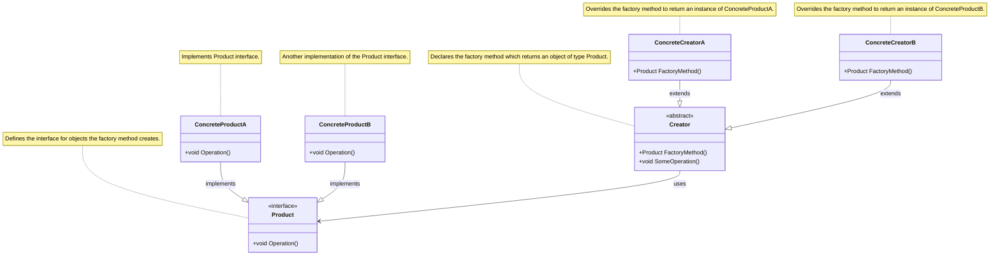
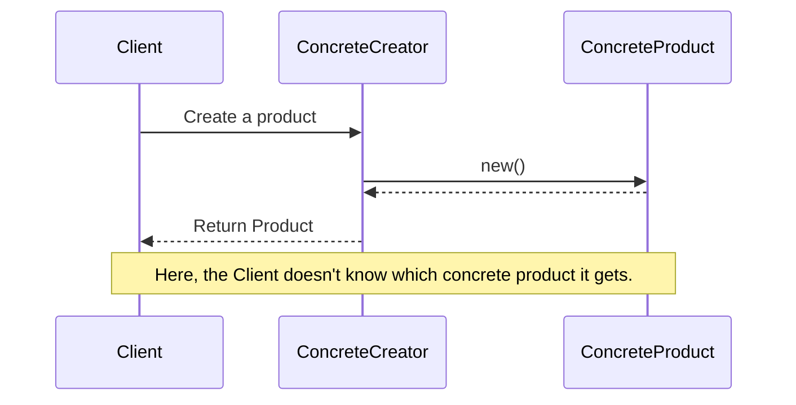

<!-- by IxI-Enki -->

# Factory
### <p align="center"> Class Diagram </p>

---
### <p align="center"> Sequence Diagram </p>

---
### <p align="center"> Implementation </p>
<div align="left">

```c#
public interface IProduct 
{ 
  void Operation(); 
}
```
```c#
public abstract class Creator
{
    public abstract IProduct FactoryMethod();
    public void SomeOperation()
    {
        var product = FactoryMethod();
        // Use product...
    }
}
```
```c#
public class ConcreteCreatorA : Creator
{
    public override IProduct FactoryMethod() => new ConcreteProductA();
}
```
</div>

<!-- by IxI-Enki -->
