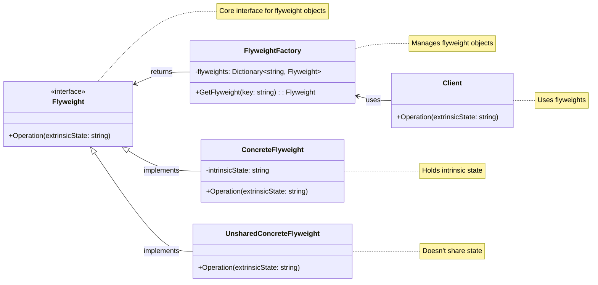
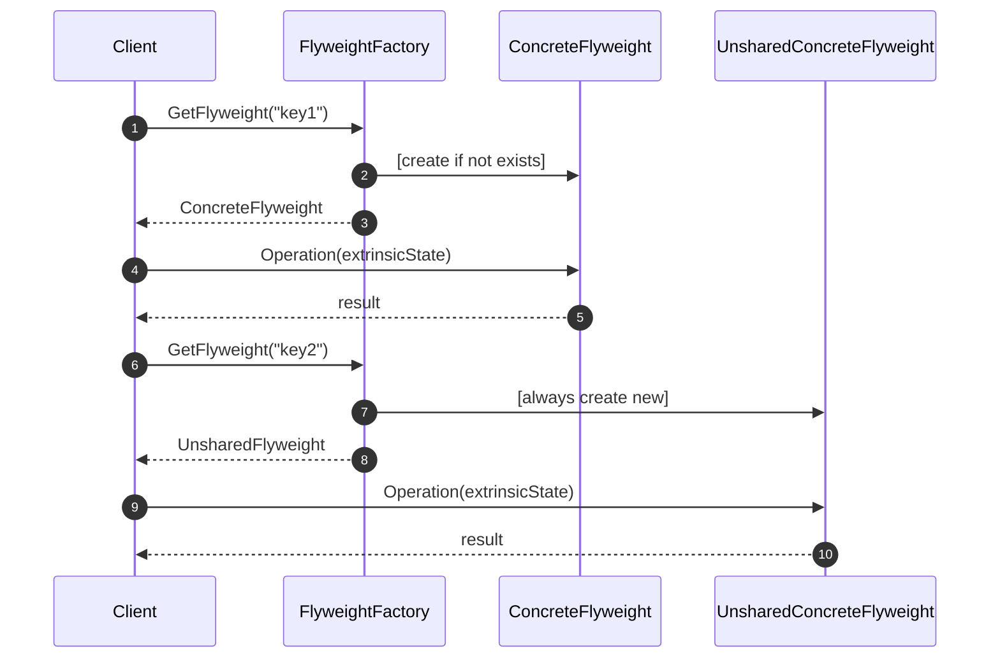

<!-- by IxI-Enki -->

# Flyweight
### <p align="center"> Class Diagram </p>

---
### <p align="center"> Sequence Diagram </p>

---
### <p align="center"> Implementation </p>
<div align="left">

```c#
public interface IFlyweight
{
    // Operation to perform using extrinsic state
    void Operation(string extrinsicState);
}
```
```c#
public class ConcreteFlyweight : IFlyweight
{
    private readonly string _intrinsicState; // shared among multiple flyweights

    public ConcreteFlyweight(string intrinsicState)
    {
        _intrinsicState = intrinsicState;
    }

    public void Operation(string extrinsicState)
    {
        // Combine intrinsic and extrinsic states for operation
        Console.WriteLine($"Flyweight: {this._intrinsicState}, External state: {extrinsicState}");
    }
}
```
```c#
public class UnsharedConcreteFlyweight : IFlyweight
{
    public void Operation(string extrinsicState)
    {
        // This flyweight doesn't have shared state, so it might use the extrinsic state directly
        Console.WriteLine($"Unshared Flyweight: External state: {extrinsicState}");
    }
}
```
```c#
public class FlyweightFactory
{
    private Dictionary<string, IFlyweight> _flyweights = new Dictionary<string, IFlyweight>();

    public IFlyweight GetFlyweight(string key)
    {
        if (!_flyweights.TryGetValue(key, out IFlyweight flyweight))
        {
            // Create a new flyweight if not present
            flyweight = new ConcreteFlyweight(key);
            _flyweights.Add(key, flyweight);
        }
        return flyweight;
    }
}
```
```c#
public class Client
{
    public void Operation(string extrinsicState)
    {
        FlyweightFactory factory = new FlyweightFactory();
        
        // Using flyweights with different keys but sharing where possible
        IFlyweight fx = factory.GetFlyweight("X");
        IFlyweight fy = factory.GetFlyweight("Y");
        IFlyweight fx2 = factory.GetFlyweight("X"); // This will reuse the existing 'X' flyweight

        fx.Operation(extrinsicState);  // Uses shared flyweight
        fy.Operation(extrinsicState);  // Uses another shared flyweight
        fx2.Operation(extrinsicState); // Reuses the 'X' flyweight

        // Here, we might use an unshared flyweight for comparison
        UnsharedConcreteFlyweight unshared = new UnsharedConcreteFlyweight();
        unshared.Operation(extrinsicState);
    }
}
```
</div>

<!-- by IxI-Enki -->