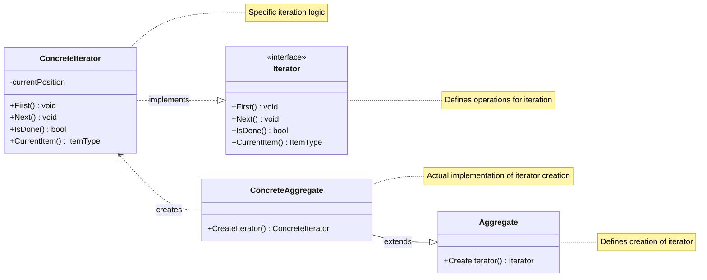
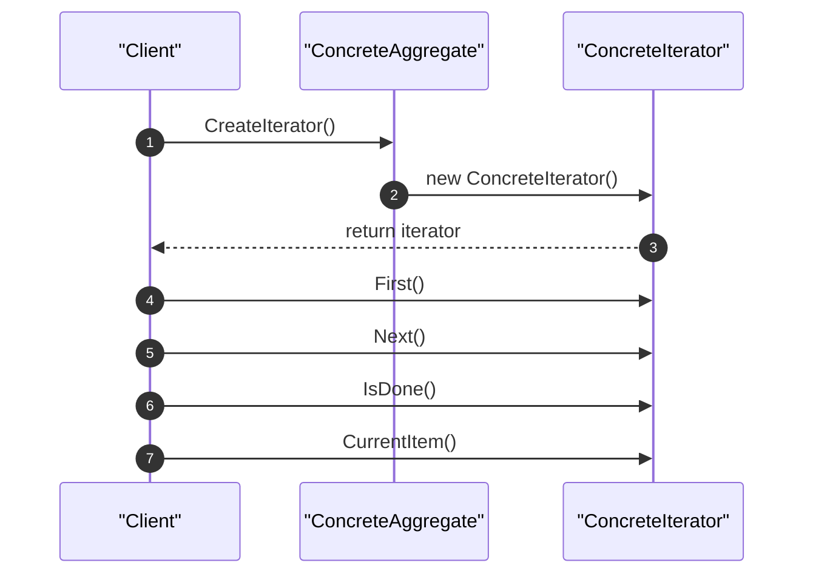

<!-- by IxI-Enki -->

# Iterator
### <p align="center"> Class Diagram </p>

---
### <p align="center"> Sequence Diagram </p>

---
### <p align="center"> Implementation </p>
<div align="left">

```c#
// Iterator interface
public interface IIterator<T>
{
    void First(); // Reset to the first element
    void Next();  // Move to next element
    bool IsDone(); // Check if iteration is complete
    T CurrentItem(); // Return current element
}
```
```c#
// Aggregate interface
public interface IAggregate<T>
{
    IIterator<T> CreateIterator();
}
```
```c#
// Concrete Aggregate implementation
public class ConcreteAggregate<T> : IAggregate<T>
{
    private List<T> items = new List<T>();

    public void AddItem(T item) => items.Add(item);

    public IIterator<T> CreateIterator()
    {
        return new ConcreteIterator<T>(this);
    }

    // Helper method for the iterator
    public T GetItem(int index) => items[index];
    public int Count => items.Count;
}
```
```c#
// Concrete Iterator implementation
public class ConcreteIterator<T> : IIterator<T>
{
    private ConcreteAggregate<T> aggregate;
    private int current = 0;

    public ConcreteIterator(ConcreteAggregate<T> aggregate)
    {
        this.aggregate = aggregate;
    }

    public void First()
    {
        current = 0;
    }

    public void Next()
    {
        if (!IsDone()) current++;
    }

    public bool IsDone()
    {
        return current >= aggregate.Count;
    }

    public T CurrentItem()
    {
        if (IsDone()) throw new InvalidOperationException("No more items");
        return aggregate.GetItem(current);
    }
}
```
```c#
// Usage example
public class Program
{
    public static void Main()
    {
        var aggregate = new ConcreteAggregate<string>();
        aggregate.AddItem("A");
        aggregate.AddItem("B");
        aggregate.AddItem("C");

        IIterator<string> iterator = aggregate.CreateIterator();
        for (iterator.First(); !iterator.IsDone(); iterator.Next())
        {
            Console.WriteLine(iterator.CurrentItem());
        }
    }
}
```
</div>

<!-- by IxI-Enki -->