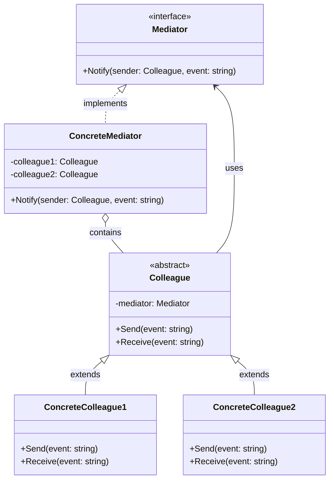
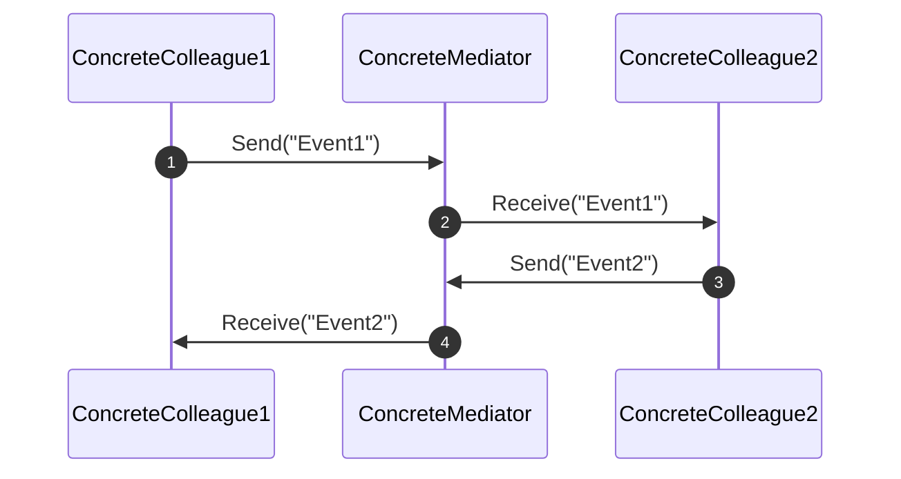

<!-- by IxI-Enki -->

# Mediator
### <p align="center"> Class Diagram </p>

---
### <p align="center"> Sequence Diagram </p>

---
### <p align="center"> Implementation </p>
<div align="left">

```c#
public interface IMediator
{
    // Notifies the mediator about an event from a colleague.
    void Notify(Colleague sender, string @event);
}
```
```c#
public class ConcreteMediator : IMediator
{
    private Colleague colleague1;
    private Colleague colleague2;

    // Sets up the mediator with two colleagues.
    public ConcreteMediator(Colleague c1, Colleague c2)
    {
        this.colleague1 = c1;
        this.colleague2 = c2;
    }

    public void Notify(Colleague sender, string @event)
    {
        // Only notify if the sender is not null and not the same as the receiver
        if (sender != colleague1)
            colleague1.Receive(@event);
        if (sender != colleague2)
            colleague2.Receive(@event);
    }
}
```
```c#
public abstract class Colleague
{
    protected IMediator mediator;

    // Constructor for setting up the mediator.
    public Colleague(IMediator mediator)
    {
        this.mediator = mediator;
    }

    // Sends an event through the mediator.
    public void Send(string @event)
    {
        mediator.Notify(this, @event);
    }

    // Receives an event from the mediator.
    public abstract void Receive(string @event);
}
```
```c#
public class ConcreteColleague1 : Colleague
{
    public ConcreteColleague1(IMediator mediator) : base(mediator) { }

    public override void Receive(string @event)
    {
        Console.WriteLine("ConcreteColleague1 received: " + @event);
    }
}

public class ConcreteColleague2 : Colleague
{
    public ConcreteColleague2(IMediator mediator) : base(mediator) { }

    public override void Receive(string @event)
    {
        Console.WriteLine("ConcreteColleague2 received: " + @event);
    }
}
```
```c#
class Program
{
    static void Main(string[] args)
    {
        IMediator mediator = new ConcreteMediator(
            new ConcreteColleague1(mediator),
            new ConcreteColleague2(mediator)
        );

        // Simulate interaction
        ((ConcreteColleague1)mediator).Send("Event1");
        ((ConcreteColleague2)mediator).Send("Event2");
    }
}
```

</div>

<!-- by IxI-Enki -->