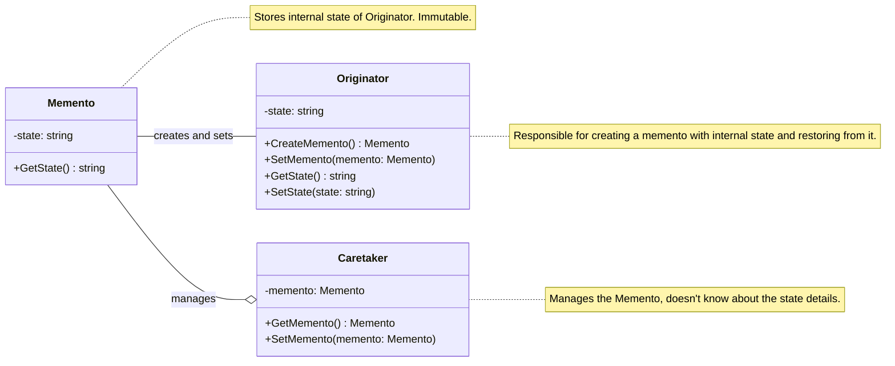
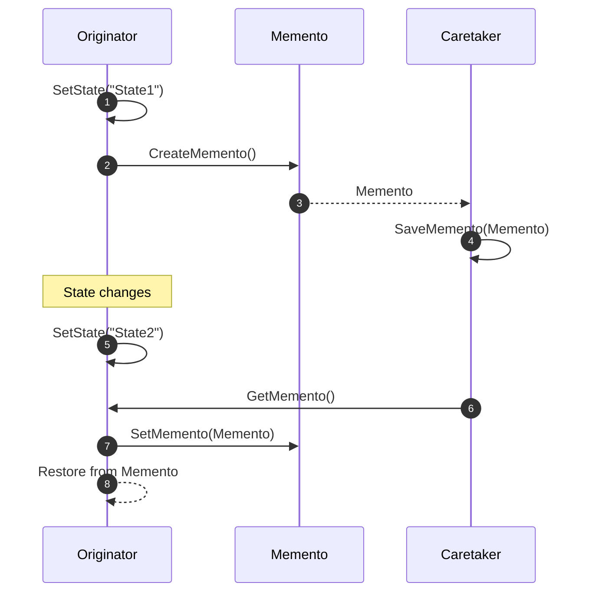

<!-- by IxI-Enki -->

# Memento
### <p align="center"> Class Diagram </p>

---
### <p align="center"> Sequence Diagram </p>

---
### <p align="center"> Implementation </p>
<div align="left">

```c#
public interface IMemento
{
    string GetState();
}
```
```c#
public class ConcreteMemento : IMemento
{
    private string _state;
    public ConcreteMemento(string state) => _state = state;

    public string GetState() => _state;
}
```

<!-- by IxI-Enki -->