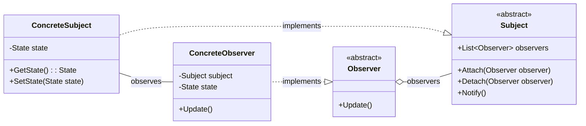
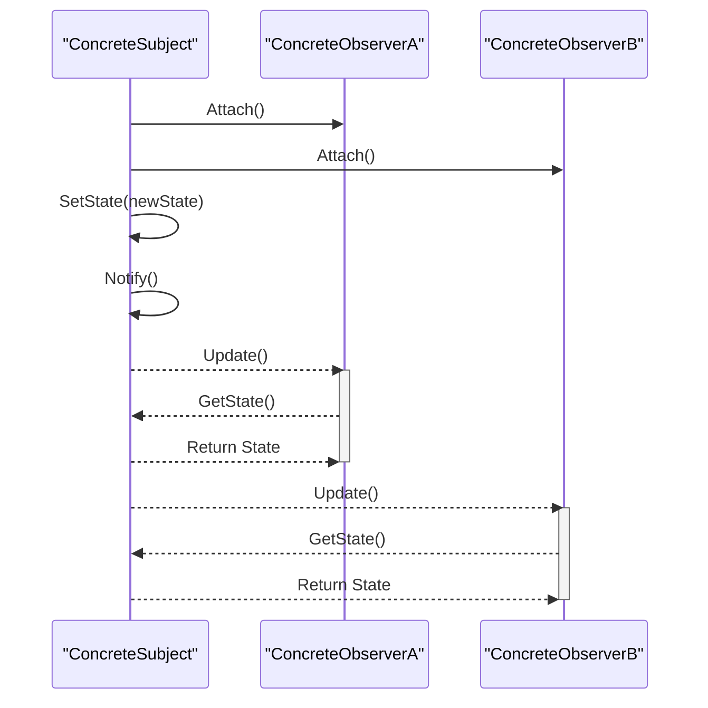

<!-- by IxI-Enki -->

# Observer
### <p align="center"> Class Diagram </p>

---
### <p align="center"> Sequence Diagram </p>

---
### <p align="center"> Implementation </p>
<div align="left">

```c#
// Subject (Abstract Class)
public abstract class Subject
{
    protected List<IObserver> observers = new List<IObserver>();
    
    public void Attach(IObserver observer) => observers.Add(observer);
    public void Detach(IObserver observer) => observers.Remove(observer);
    public void Notify() 
    {
        foreach (var observer in observers) 
        {
            observer.Update();
        }
    }
}
```
```C#
// ConcreteSubject 
public class ConcreteSubject : Subject
{
    private string _state;

    public string State 
    { 
        get => _state; 
        set 
        { 
            _state = value; 
            Notify(); 
        } 
    }
}
```
```C#
// Observer (Interface in C#)
public interface IObserver
{
    void Update();
}
```
```C#
// ConcreteObserver
public class ConcreteObserver : IObserver
{
    private string _observerState;
    private ConcreteSubject _subject;

    public ConcreteObserver(ConcreteSubject subject)
    {
        this._subject = subject;
    }

    public void Update()
    {
        _observerState = _subject.State;
        // Perform actions based on new state
    }
}
```

<!-- by IxI-Enki -->