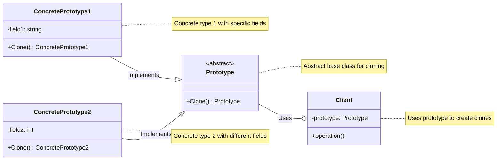
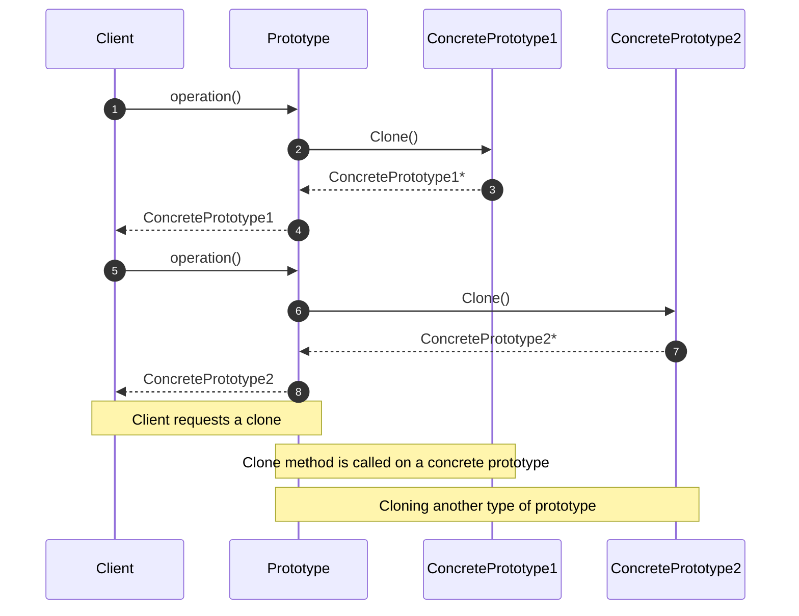

<!-- by IxI-Enki -->

# Prototype
### <p align="center"> Class Diagram </p>

---
### <p align="center"> Sequence Diagram </p>

---
### <p align="center"> Implementation </p>  
<div align="left">

```c#
// Abstract base class for cloning
public abstract class Prototype
{
    public abstract Prototype Clone();
}
```
```c#
// Concrete prototype with string field
public class ConcretePrototype1 : Prototype
{
    private string field1;

    public ConcretePrototype1(string field1)
    {
        this.field1 = field1;
    }

    // Override clone method for deep copy if necessary
    public override Prototype Clone()
    {
        return new ConcretePrototype1(this.field1);
    }
}
```
```c#
// Concrete prototype 2
// Another concrete prototype with integer field
public class ConcretePrototype2 : Prototype
{
    private int field2;

    public ConcretePrototype2(int field2)
    {
        this.field2 = field2;
    }

    // Override clone method for deep copy if necessary
    public override Prototype Clone()
    {
        return new ConcretePrototype2(this.field2);
    }
}
```
```c#
// Client class using prototypes
public class Client
{
    private Prototype prototype;

    public Client(Prototype prototype)
    {
        this.prototype = prototype;
    }

    public void Operation()
    {
        // Cloning the prototype
        Prototype newPrototype = prototype.Clone();
        // Use newPrototype for further operations
    }
}
```
</div>

<!-- by IxI-Enki -->