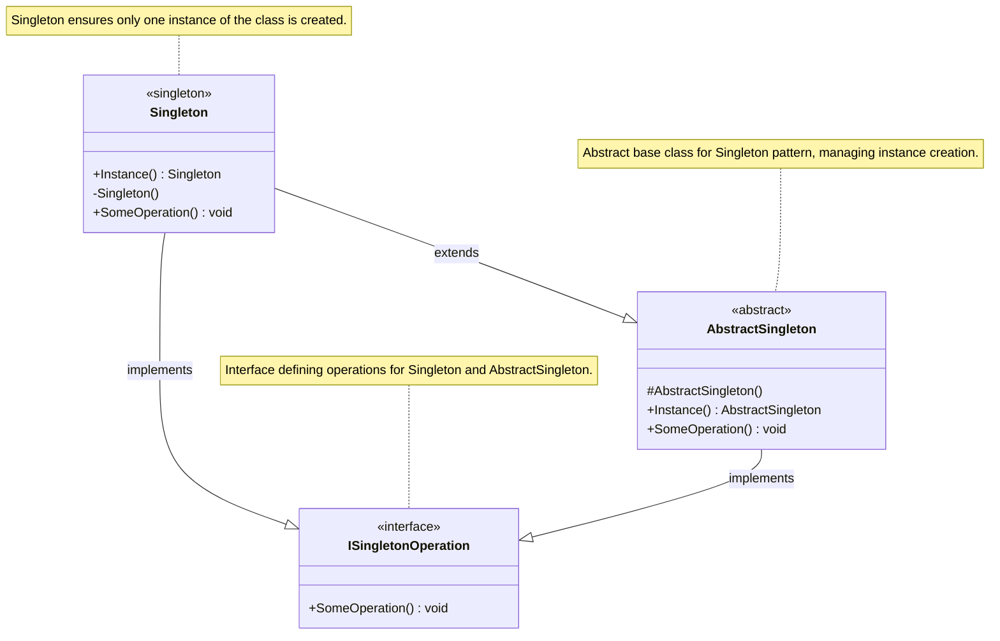
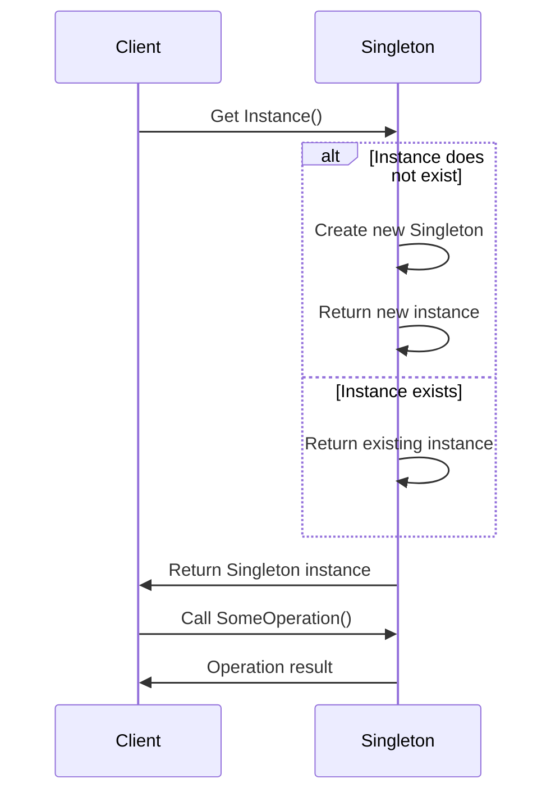

### <p align="center"> Class Diagram </p>

---
### <p align="center"> Sequence Diagram </p>

---
### <p align="center"> Implementation </p>
<div align="left">

```c#
  public sealed class Singleton : ISingletonOperation
  {
      private static readonly Singleton _instance = new Singleton();
      private Singleton() { } // Private constructor

      public static Singleton Instance => _instance;

      public void SomeOperation()
      {
          // Implementation
      }
  }
```
```c#
public interface ISingletonOperation
{
    void SomeOperation();
}
```
```c#
  public abstract class AbstractSingleton : ISingletonOperation
  {
      protected AbstractSingleton() { } // Protected constructor
      public abstract void SomeOperation();
  }
```
</div>

<!-- by IxI-Enki -->