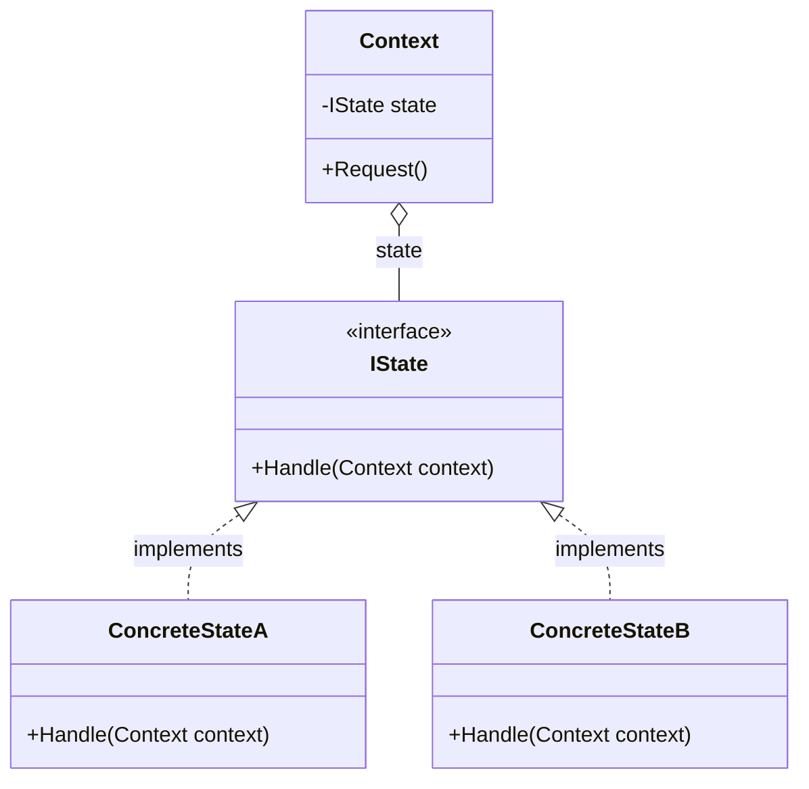
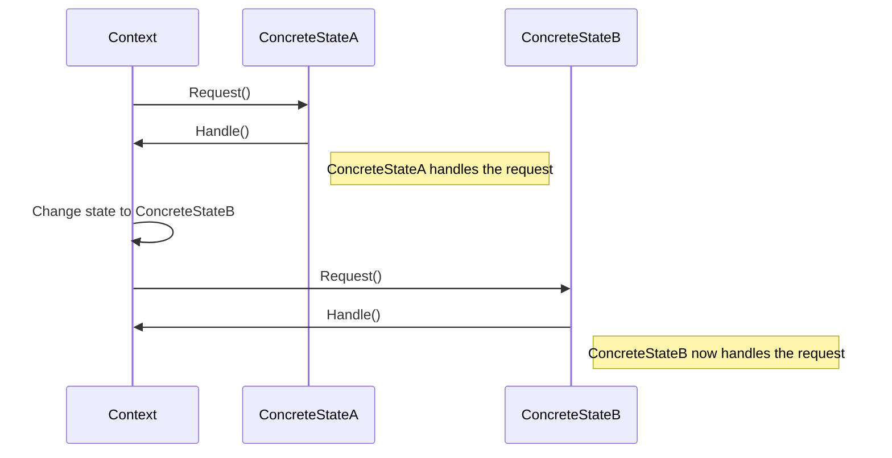

### <p align="center"> Class Diagram </p>

---
### <p align="center"> Sequence Diagram </p>

---
### <p align="center"> Implementation </p>
<div align="left">

```c#
public interface IState
{
    void Handle(Context context);
}

public class Context
{
    private IState state;

    public Context(IState initialState)
    {
        this.state = initialState;
    }

    public void Request()
    {
        state.Handle(this);
    }

    // Method to change state
    public void ChangeState(IState newState)
    {
        this.state = newState;
    }
}
```
```c#
public class ConcreteStateA : IState
{
    public void Handle(Context context)
    {
        // Handle logic specific to State A
        Console.WriteLine("ConcreteStateA handles request.");
        // Optionally change state here
        // context.ChangeState(new ConcreteStateB());
    }
}
```
```c#
public class ConcreteStateB : IState
{
    public void Handle(Context context)
    {
        // Handle logic specific to State B
        Console.WriteLine("ConcreteStateB handles request.");
        // Optionally change state here
        // context.ChangeState(new ConcreteStateA());
    }
}
```
</div>

<!-- by IxI-Enki -->
