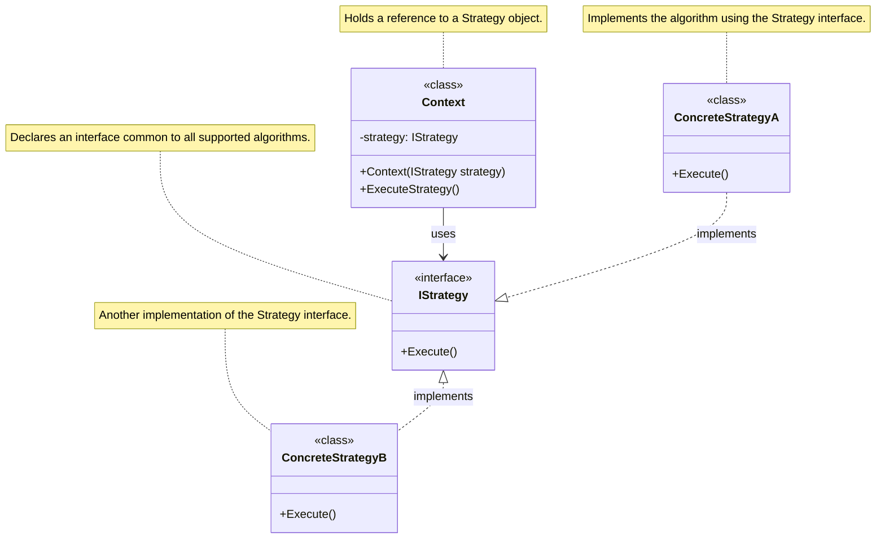
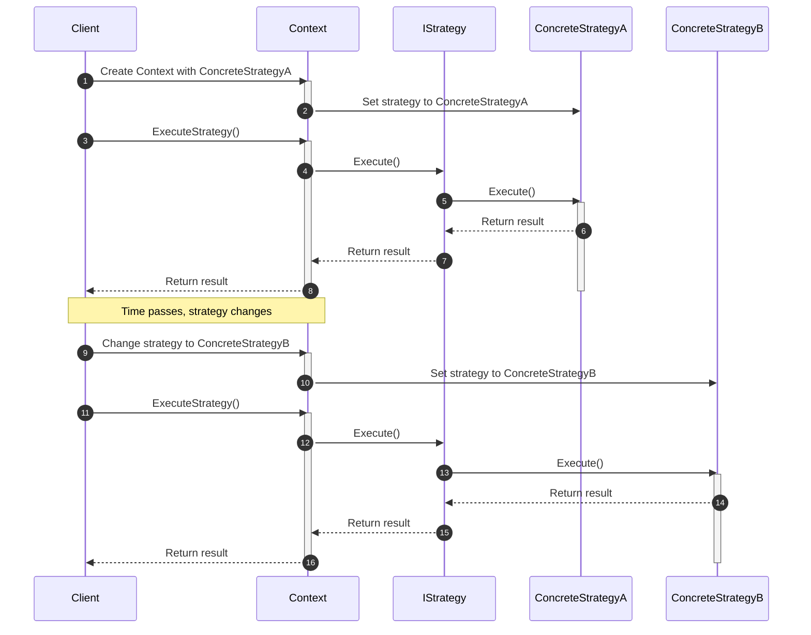

<!-- by IxI-Enki -->

# Strategy
### <p align="center"> Class Diagram </p>

---
### <p align="center"> Sequence Diagram </p>

---
### <p align="center"> Implementation </p>
<div align="left">

```c#
 public interface IStrategy
{
    void Execute();
}
```
```c#
public class ConcreteStrategyA : IStrategy
{
    public void Execute()
    {
        // Implement strategy A
    }
}

public class ConcreteStrategyB : IStrategy
{
    public void Execute()
    {
        // Implement strategy B
    }
}
```
```c#
public class Context
{
    private IStrategy strategy;

    public Context(IStrategy strategy)
    {
        this.strategy = strategy;
    }

    public void ExecuteStrategy()
    {
        strategy.Execute();
    }

    public void SetStrategy(IStrategy strategy)
    {
        this.strategy = strategy;
    }
}
```
</div>

<!-- by IxI-Enki -->