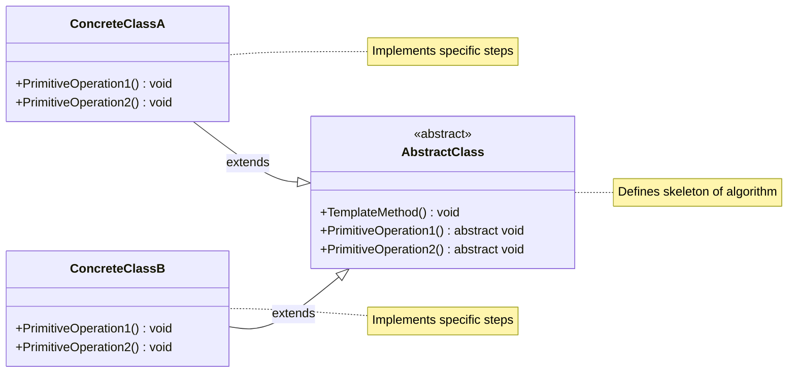
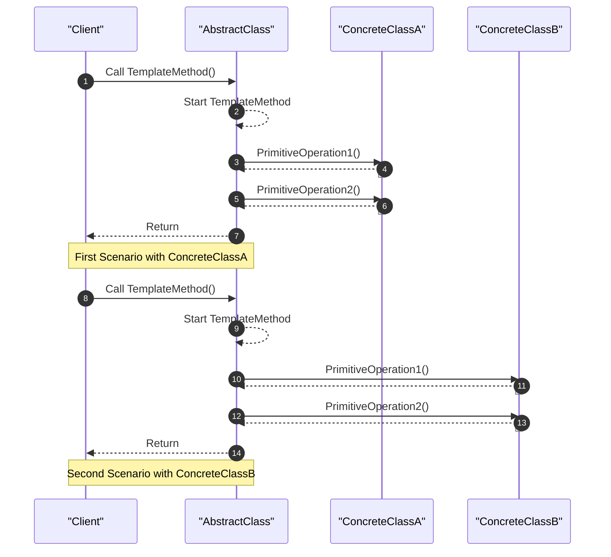

<!-- by IxI-Enki -->

# Template Method
### <p align="center"> Class Diagram </p>

---
### <p align="center"> Sequence Diagram </p>

---
### <p align="center"> Implementation </p>
<div align="left">

```c#
public abstract class AbstractClass
{
    // Template method defines the skeleton of an algorithm
    public void TemplateMethod()
    {
        PrimitiveOperation1();
        PrimitiveOperation2();
        Console.WriteLine("Common implementation");
    }

    // Abstract methods to be implemented by subclasses
    public abstract void PrimitiveOperation1();
    public abstract void PrimitiveOperation2();
}
```
```c#
public class ConcreteClassA : AbstractClass
{
    // Implementation of PrimitiveOperation1 specific to ClassA
    public override void PrimitiveOperation1()
    {
        Console.WriteLine("ConcreteClassA: PrimitiveOperation1");
    }

    // Implementation of PrimitiveOperation2 specific to ClassA
    public override void PrimitiveOperation2()
    {
        Console.WriteLine("ConcreteClassA: PrimitiveOperation2");
    }
}

public class ConcreteClassB : AbstractClass
{
    // Implementation of PrimitiveOperation1 specific to ClassB
    public override void PrimitiveOperation1()
    {
        Console.WriteLine("ConcreteClassB: PrimitiveOperation1");
    }

    // Implementation of PrimitiveOperation2 specific to ClassB
    public override void PrimitiveOperation2()
    {
        Console.WriteLine("ConcreteClassB: PrimitiveOperation2");
    }
}
```
```c#
class Program
{
    static void Main(string[] args)
    {
        AbstractClass aA = new ConcreteClassA();
        aA.TemplateMethod();

        AbstractClass aB = new ConcreteClassB();
        aB.TemplateMethod();
    }
}
```
</div>

<!-- by IxI-Enki -->