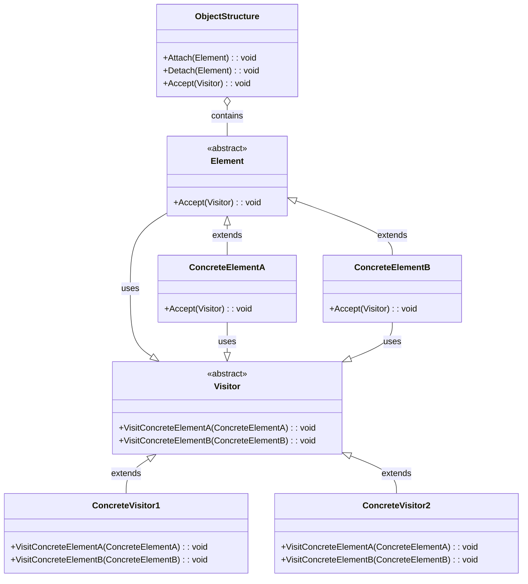
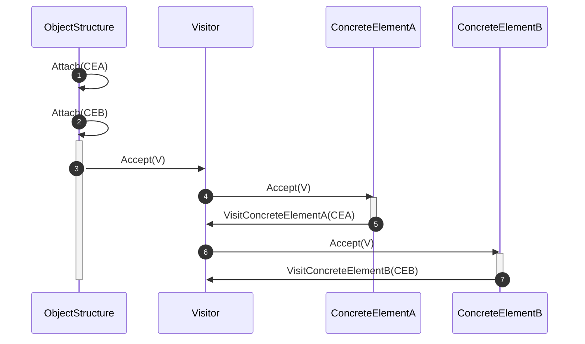

<!-- by IxI-Enki -->

# Visitor
### <p align="center"> Class Diagram </p>

---
### <p align="center"> Sequence Diagram </p>

---
### <p align="center"> Implementation </p>
<div align="left">

```c#
public abstract class Element
{
    public abstract void Accept(Visitor visitor);
}
```
```c#
public class ConcreteElementA : Element
{
    public override void Accept(Visitor visitor)
    {
        // Calls the appropriate Visit method on the visitor
        visitor.VisitConcreteElementA(this);
    }

    public void OperationA()
    {
        // Element specific operation
    }
}

public class ConcreteElementB : Element
{
    public override void Accept(Visitor visitor)
    {
        visitor.VisitConcreteElementB(this);
    }

    public void OperationB()
    {
        // Another element specific operation
    }
}
```
```c#
public abstract class Visitor
{
    public abstract void VisitConcreteElementA(ConcreteElementA elementA);
    public abstract void VisitConcreteElementB(ConcreteElementB elementB);
}
```
```c#
public class ConcreteVisitor1 : Visitor
{
    public override void VisitConcreteElementA(ConcreteElementA element)
    {
        // Perform operation on ConcreteElementA
        Console.WriteLine("ConcreteVisitor1 on ConcreteElementA");
    }

    public override void VisitConcreteElementB(ConcreteElementB element)
    {
        // Perform operation on ConcreteElementB
        Console.WriteLine("ConcreteVisitor1 on ConcreteElementB");
    }
}

public class ConcreteVisitor2 : Visitor
{
    public override void VisitConcreteElementA(ConcreteElementA element)
    {
        // Another operation on ConcreteElementA
        Console.WriteLine("ConcreteVisitor2 on ConcreteElementA");
    }

    public override void VisitConcreteElementB(ConcreteElementB element)
    {
        // Another operation on ConcreteElementB
        Console.WriteLine("ConcreteVisitor2 on ConcreteElementB");
    }
} 
```
```c#
public class ObjectStructure
{
    private List<Element> elements = new List<Element>();

    public void Attach(Element element)
    {
        elements.Add(element);
    }

    public void Detach(Element element)
    {
        elements.Remove(element);
    }

    public void Accept(Visitor visitor)
    {
        foreach (var element in elements)
        {
            element.Accept(visitor);
        }
    }
}
```
</div>

<!-- by IxI-Enki -->

